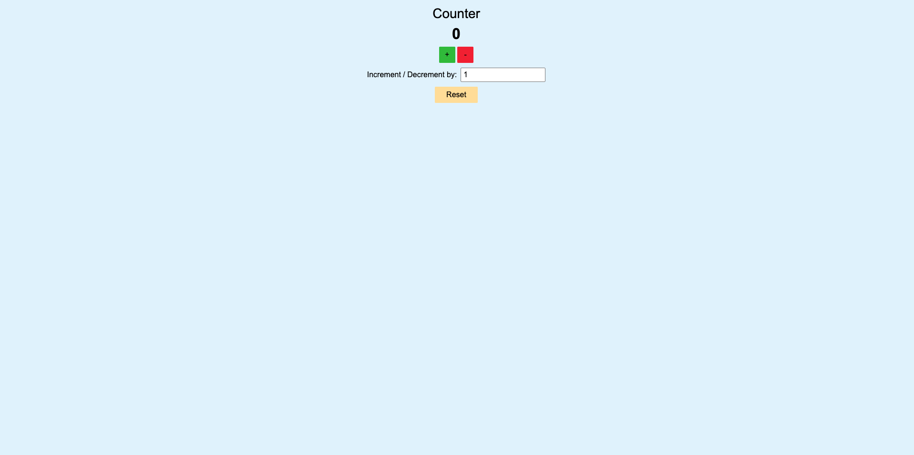

# Application

This counter application is a simple interactive tool developed using Vanilla JavaScript for the frontend, Express for the backend and Docker for deployment. It allows users to increment, decrement, or reset a numeric value displayed on the screen. Here's how it works:

### Display of Count:

The large number in the center (currently "0") represents the current count value.

### Increment and Decrement Buttons:

The "+" button increases the counter by a specified value.
The "-" button decreases the counter by a specified value.

### Input Field

The input field labeled "Increment / Decrement by" lets users set how much the counter changes with each click of the "+" or "-" buttons. For example, entering "5" means the counter will increase or decrease by 5 each time.

### Reset Button:

Clicking the "Reset" button resets the counter to its initial value (typically 0).

# Development

I began developing this counter application by first creating the HTML and CSS structure to design the static layout and ensure the interface was visually appealing. Once the structure was complete, I incorporated JavaScript to enable dynamic behavior, such as updating the counter value and handling user interactions. After finalizing the functionality, I integrated Express as the backend framework to set up local hosting and used Nodemon to streamline the development process by automatically restarting the server during updates. Finally, I containerized the application by creating a Docker image, ensuring it is portable and easy to deploy across different environments.
